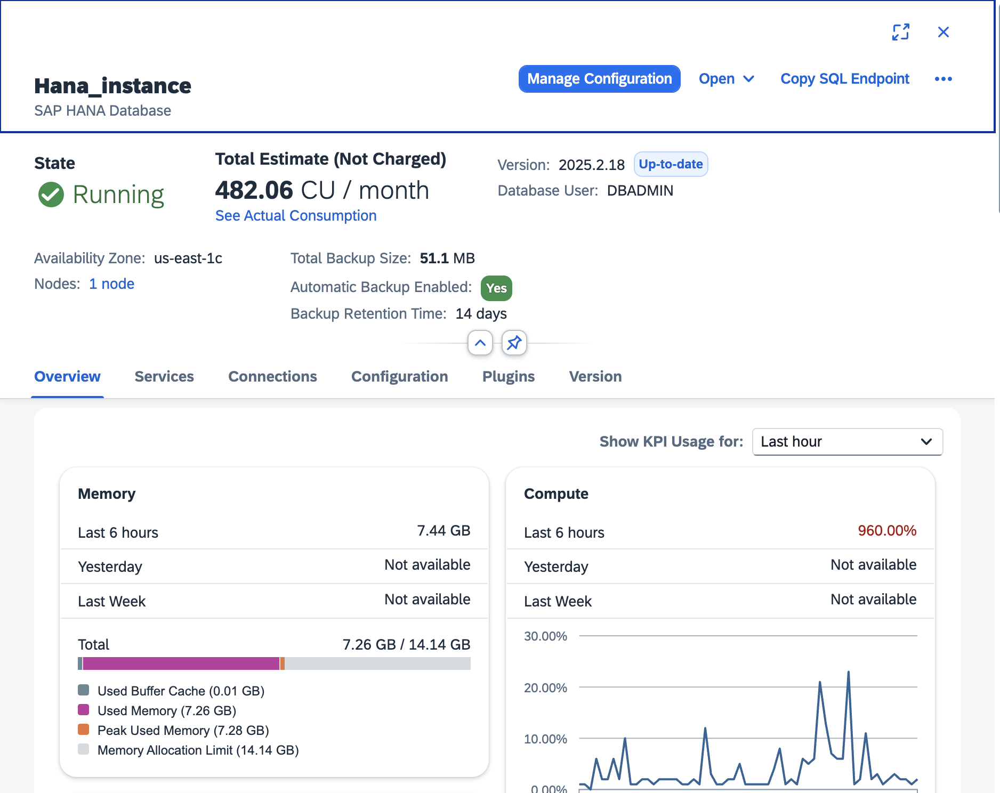
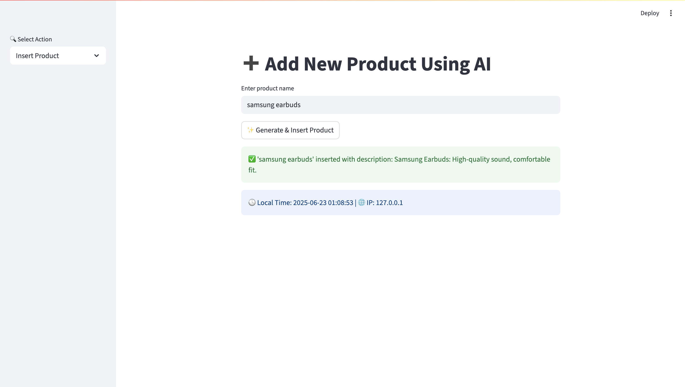
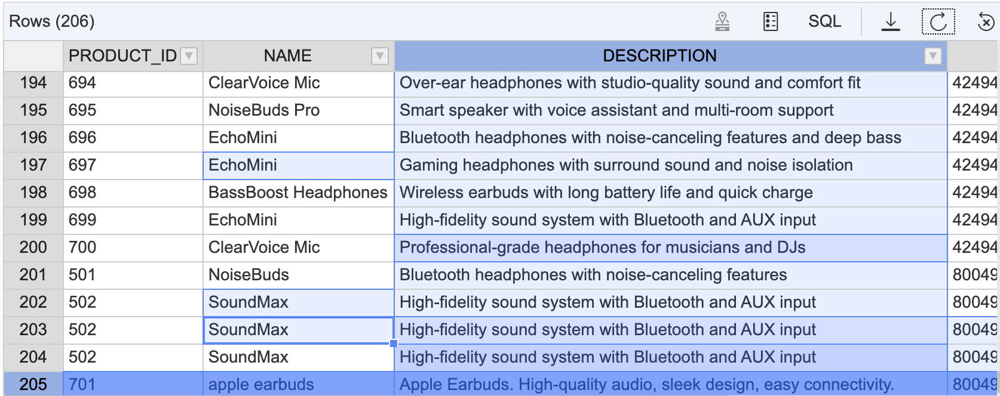
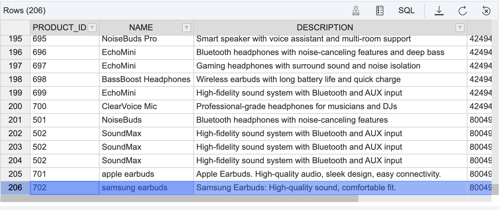

# 🧠 Retail Insights AI Assistant with SAP HANA Cloud

This project is an interactive **Streamlit** web application that connects to **SAP HANA Cloud**, allowing users to explore product insights using an AI assistant powered by **Cohere LLM** and **vector embeddings**.

---

## 📸 Project Snapshots

### 🔧 SAP HANA Cloud Instance Running


### 🧑‍💻 App UI - Product Insights Page


### ➕ Before Inserting New Product


### ✅ After Inserting New Product Using AI


---

## 📚 Features

- 🔍 **Explore Product Descriptions**: Select any product from SAP HANA and let AI explain it.
- 🤖 **AI-generated Descriptions**: Insert new products using LLM-generated 10-word descriptions.
- 🧠 **Embeddings**: Description vectors are generated and stored in SAP HANA for contextual search.
- 🗃️ **Chat Logging**: All queries and responses are saved into a `CHAT_LOG` table.
- 🧭 **Menu Navigation**: Use sidebar menu to switch between *Product Insights* and *Insert Product* sections.

---

## 🛠️ Tech Stack

- **Frontend**: [Streamlit](https://streamlit.io/)
- **Database**: [SAP HANA Cloud](https://www.sap.com/products/technology-platform/hana/cloud.html)
- **Embeddings**: [Sentence Transformers](https://www.sbert.net/)
- **LLM**: [Cohere `command-r-plus`](https://cohere.com/)
- **Language**: Python 3.11+
- **DB Driver**: `hdbcli` (SAP HANA Python Client)

---

## 🚀 Setup Instructions

### 1. Clone this Repository
```bash
git clone https://github.com/Sushiiel/SAP_HANA_CLOUD.git

### 2. Deployed UI
https://sap-hana-cloud.streamlit.app/
